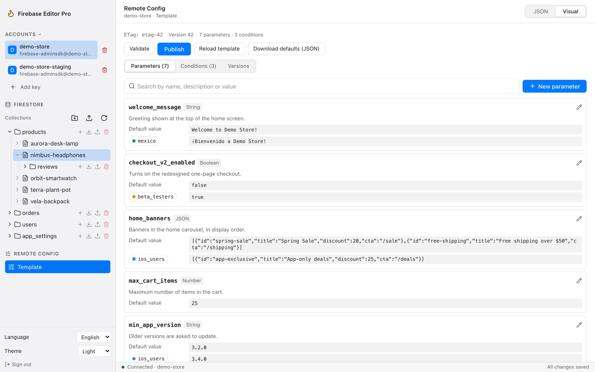
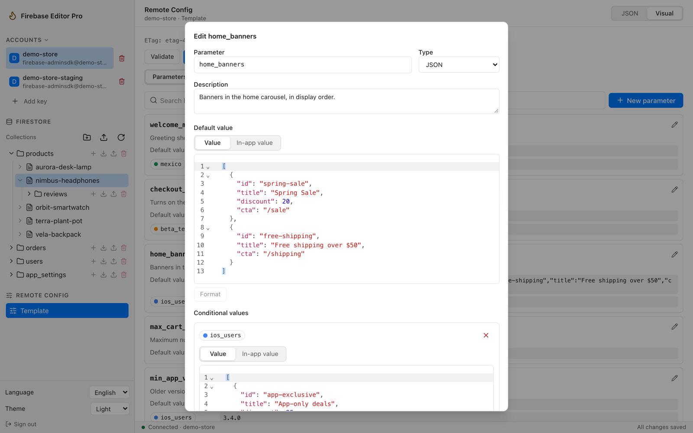
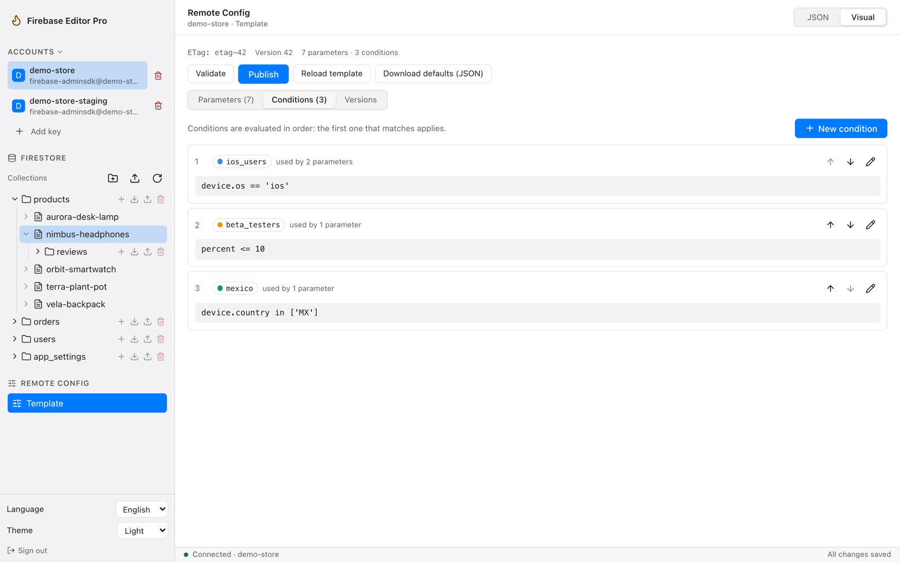
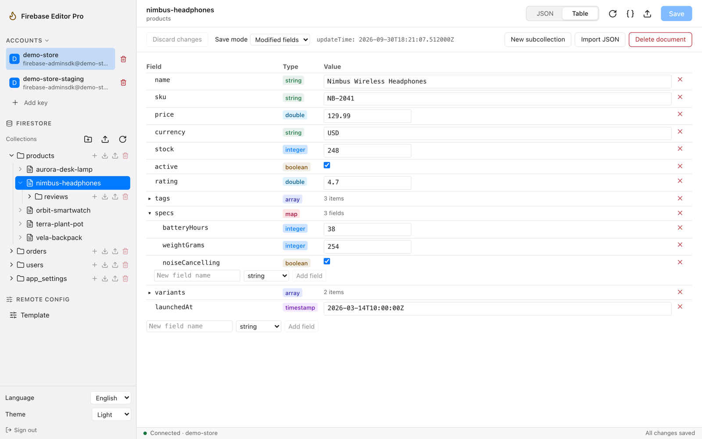
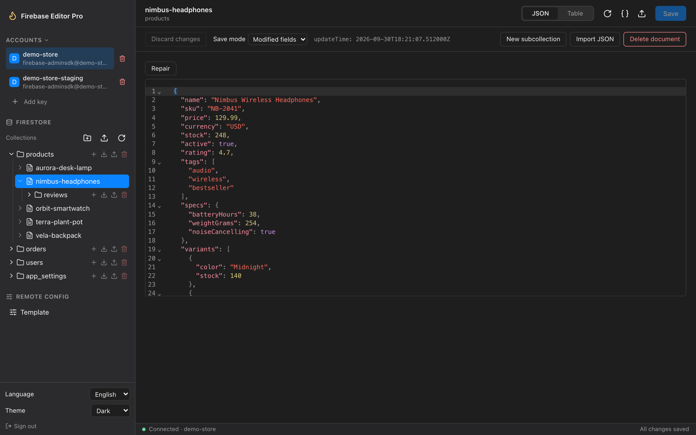

# Firebase Editor Pro

Firebase Editor Pro is a lightweight desktop app (macOS and Windows, built with Tauri 2) to edit **Firestore documents** (as a typed table or as JSON) and the **Remote Config template** (in a visual editor or as JSON). The interface is bilingual (Español / English) and has light and dark themes.

**[Download the latest release](https://github.com/ErickEsp117/firebase-editor-pro/releases/latest)** (macOS universal `.dmg`, Windows `.exe`).

- **Sign-in with `key.json` only.** You import the service account key of your Firebase project. There is no Google login.
- **Credential in the system keychain.** On the desktop app the key is stored only in the macOS Keychain or the Windows Credential Manager. It is never written to a plain file.
- **Small installers** (about 8 MB on macOS and 3 MB on Windows).
- The app talks directly to the Google APIs (`oauth2.googleapis.com` for the access token, `firestore.googleapis.com` and `firebaseremoteconfig.googleapis.com`). There is no server in between.

## Screenshots

Remote Config visual editor: every parameter with its description, default value and conditional values.



Editing a parameter: editors by type, JSON shown formatted and validated, conditional values with their condition colors.



| Conditions in evaluation order | Firestore document as a typed table |
| --- | --- |
|  |  |

Firestore document as JSON, dark theme:



<sub>The screenshots use a fictional demo project; no real data.</sub>

## Install

Release builds are **not code-signed**, so each operating system shows a warning the first time you open the app.

### macOS

1. From [Releases](https://github.com/ErickEsp117/firebase-editor-pro/releases/latest), download `Firebase.Editor.Pro_<version>_universal.dmg` (one build for Apple Silicon and Intel).
2. Open the `.dmg` and drag **Firebase Editor Pro** to `Applications`.
3. Open the app once. macOS says it cannot verify the developer; close that message.
4. Go to **System Settings > Privacy & Security** and click **Open Anyway** next to the app name, then confirm. You only need to do this once per installed version. (On macOS 14 and earlier, right-click the app and choose **Open** also works; macOS 15 and later removed that shortcut.)

#### The keychain password prompt

The first time a version of the app reads your saved keys, macOS asks for your **login keychain password** ("Firebase Editor Pro wants to use your confidential information…"). Enter it and click **Always Allow**. Release builds from GitHub Actions are not signed with an Apple certificate, so macOS treats every new version as a different app and asks once again after each update; reopening the same version does not ask. Builds signed with your own Apple certificate do not have this problem (see *Signed builds without keychain prompts* below).

All saved keys live in a single keychain item, so after **Always Allow** it is one prompt per update and none when you reopen the same version. Choosing **Allow** (the default button) instead makes macOS ask again on every later change, such as switching or adding an account.

### Windows

1. From [Releases](https://github.com/ErickEsp117/firebase-editor-pro/releases/latest), download `Firebase.Editor.Pro_<version>_x64-setup.exe` (NSIS installer).
2. Run it. If SmartScreen shows "Windows protected your PC", click **More info** (*Más información*) and then **Run anyway** (*Ejecutar de todas formas*).
3. The app needs **Microsoft WebView2**. It is already included in Windows 11 and in up-to-date Windows 10. If it is missing, the installer downloads it. You can also install the Evergreen runtime from Microsoft.

## Import your `key.json`

1. In the Firebase console open **Project settings > Service accounts**.
2. Click **Generate new private key** and save the JSON file.
3. Open the app and click **Import key.json**, then pick that file.
4. The app checks the key, requests a token from Google and shows the project name and its collections. The key is saved in the system keychain, so you stay connected after you restart the app.
5. **Sign out** returns to the welcome screen and keeps your saved keys in the keychain.

The service account needs IAM roles for what you want to do: for example *Cloud Datastore User* for Firestore and *Firebase Remote Config Admin* for Remote Config. The default Firebase Admin SDK account has both. If a role is missing the app explains the 403 error and what to grant.

> **Keep your key private.** Anyone with `key.json` has admin access to your project. Do not share it, and do not put it inside this repository.

## Multiple accounts

Use **Add key** to save more than one service account. Each account is labeled with its project and email. Select an account in the sidebar to switch; Firestore and Remote Config reload for that account. Re-importing the same key selects its existing entry.

- **Sign out** keeps every saved key and returns to the account list.
- **Delete key** asks for confirmation, then removes that account and its keychain credential. Deleting the active account selects another saved account, or returns to the welcome screen.
- Switching accounts, adding a key, signing out, or deleting the active key asks before discarding unsaved document or Remote Config changes. Cancel keeps the draft.
- Native credentials remain in the system keychain; account metadata contains no private keys or access tokens.
- If the system cannot delete a removed credential, the app shows a warning so the failure is visible.

## Appearance and keyboard shortcuts

**System** is the default theme and follows OS changes live, including both JSON editors. Light and Dark overrides are saved. On macOS the sidebar uses the native translucent material and system accent; Windows 11 uses Mica, and Windows 10 uses a solid fallback. The content pane stays opaque.

| Action | macOS | Windows |
| --- | --- | --- |
| Save document / open Remote Config publish confirmation | ⌘S | Ctrl+S |
| Format active JSON | ⌘⇧F | Ctrl+Shift+F |
| Reload current data | ⌘R | Ctrl+R |
| Firestore / Remote Config | ⌘1 / ⌘2 | Ctrl+1 / Ctrl+2 |
| Close a dialog without confirming | Esc | Esc |

Reload refreshes application data without reloading the window. A dirty document or template asks before discarding edits. With a dialog open, the other application shortcuts are paused. Remote Config publication always requires its explicit confirmation.

## Basic use

Use the sidebar to move between Firestore and Remote Config. Language and theme are at the bottom of the sidebar. Drag its divider (or focus it and use the arrow keys) to resize it; the width is saved.

### Firestore editor

- Browse collections, documents and subcollections in the tree. Use **Load more** for long collections.
- Open a document to see it as a **Table** (typed fields you can expand, edit, add and delete) or as **JSON** (a code editor with **Format** and **Repair**).
- Special Firestore types are written as tags, for example `{"__type__": "timestamp", "__value__": "2026-09-30T12:34:56Z"}`. Supported tags: `timestamp`, `geopoint`, `reference`, `bytes`, `integer`, `double`, `nan`, `infinity`, `-infinity`. Large integers (int64) keep their exact value.
- **Save** can send only the **modified fields** or the **full document**. Each save checks the document's `updateTime`. If someone else changed the document, a conflict dialog lets you **Reload** (discard your edits) or **Force save** (overwrite).
- Create documents, collections and subcollections, and delete documents or whole collections (with a count and a confirmation).
- **Export JSON / Export collection** and **Import JSON / Import collection** move data to and from files (limit 32 MiB per file).

### Remote Config editor

- Switch between the **Visual** editor and the **JSON** editor at the top right; both edit the same draft. The current **ETag** and version are shown above.
- **Visual**: tabs for Parameters, Conditions and Versions. Each parameter is a card with its type, description, default value and conditional values; search by name, description or value. Click a card to edit it in a dialog (multi-line text, number, true/false, or JSON with formatting and validation) and **Apply** all changes at once. Conditions show their full expression and how many parameters use them; reorder them (the first match wins) or rename them, which also renames them in every parameter. Fields the editor does not know are preserved.
- **JSON**: the whole template (conditions, parameters, conditional values) in a code editor with **Format**.
- **Validate** checks the template locally and with Remote Config (nothing is published). **Publish** asks for an optional version description and always sends the ETag.
- If the template changed in Remote Config since you loaded it, the conflict dialog lets you **Reload** (your edits are re-applied to the new template) or **Force publish**.
- The **Versions** list shows the history, and **Rollback** restores an older version as a new one.
- **Download defaults (JSON)** saves the default values file.

## Development

Requirements: Node 24 with npm, the Rust toolchain (`rustup`), and the [Tauri 2 prerequisites](https://tauri.app/start/prerequisites/) for your OS.

```bash
npm install

npm run dev          # browser mode at http://127.0.0.1:1420 (localStorage + WebCrypto adapters, Google APIs through the Vite proxy)
npm run tauri dev    # native window with the real keychain (own service "com.firebaseeditorpro.app.dev") and HTTP plugin

npm run typecheck    # tsc --noEmit
npm run lint         # eslint
npm run test         # vitest (also runs tests-integration/ when dev-secrets/test-key.json exists)
cargo test --manifest-path src-tauri/Cargo.toml   # Rust tests (keychain roundtrip, JWT, file commands)
```

Development builds keep their keys under a separate keychain service, so they never read or rewrite the keys saved by the installed app. Release builds run as a single instance: opening the app again focuses the running window. On macOS all saved keys live in one keychain item (`fbep-vault-v1`).

Run all checks at once:

```bash
npm run typecheck && npm run lint && npm run test && cargo test --manifest-path src-tauri/Cargo.toml
```

### Integration tests against a real project

`tests-integration/` talks to a real Firebase project. It is skipped automatically when `dev-secrets/test-key.json` is missing. Tests only write documents and Remote Config entries whose names start with `fbep_test_`, and they clean up after themselves. Use a test project, never production data.

The Remote Config cases that publish and roll back the template are opt-in (`FBEP_RC_WRITE_TESTS=1 npx vitest run tests-integration`); each run creates real template versions. The Rust tests that call Google are ignored by default (`FBEP_TEST_KEY=dev-secrets/test-key.json cargo test --manifest-path src-tauri/Cargo.toml -- --ignored`). `scripts/` has small helpers for manual testing with the same key (read a document, touch a test document, publish a test parameter); they only change names that start with `fbep_test_`.

### Build installers

```bash
rustup target add aarch64-apple-darwin x86_64-apple-darwin   # once, on macOS
CI=true npm run tauri build -- --target universal-apple-darwin   # macOS universal .app + .dmg
npm run tauri build -- --bundles nsis                            # Windows NSIS installer
```

On macOS, `CI=true` skips the Finder styling step of the `.dmg` bundler, which fails in headless shells. Bundles are written under `src-tauri/target/<target>/release/bundle/`.

#### Signed builds without keychain prompts

macOS remembers **Always Allow** for an app signed with an Apple-issued certificate across every later build signed by the same team, so the keychain password prompt appears only once. A free **Apple Development** certificate is enough for builds you use on your own Mac (Xcode > Settings > Accounts > Manage Certificates > + Apple Development). Find its exact name and build with it:

```bash
security find-identity -v -p codesigning
APPLE_SIGNING_IDENTITY="Apple Development: Your Name (XXXXXXXXXX)" CI=true npm run tauri build -- --target universal-apple-darwin
```

The first signed build asks once (macOS also asks once to let `codesign` use the certificate during the build); choose **Always Allow**. To give the app to other people without prompts or the Gatekeeper warning, sign it with a **Developer ID Application** certificate (paid Apple Developer Program) and notarize it; the Apple Development certificate is meant for development only. The identity name is personal, so it is passed through the environment instead of `tauri.conf.json`, and the GitHub release workflow stays unsigned.

### Release

The `release` workflow (`.github/workflows/release.yml`) runs on every tag `v*` and can also be started by hand (**Actions > release > Run workflow**). It builds the macOS universal `.dmg` and the Windows NSIS `.exe` and uploads them as run artifacts. On a tag it also creates a **draft release** with both files; review its notes and publish it from **Releases**.

## Do not commit `dev-secrets/`

`dev-secrets/` holds local credentials (such as `test-key.json`) for the integration tests. It is listed in `.gitignore` and **must never be committed or copied elsewhere**. Before every commit, check `git status` and make sure nothing under `dev-secrets/` is staged. To audit the repository:

```bash
git ls-files | grep '^dev-secrets/'                       # must print nothing
git grep -n -e '-----BEGIN [A-Z ]*PRIVATE KEY' -e 'MII[E]'    # must print nothing
```

If a key was ever committed or shared, revoke it in the Firebase console (Service accounts > manage keys) and create a new one.

## Release smoke test

1. Install the `.dmg` (or `.exe`), open the app natively (Privacy & Security > Open Anyway on macOS 15+), and confirm the window appears and stays open.
2. Import a `key.json`. Confirm the project name and the collection list appear.
3. Quit the app completely (Cmd+Q on macOS) and open it again. Confirm it connects without asking for the key again (the credential persisted in the keychain) and, after **Always Allow** on the first launch, without a keychain password prompt.
4. Switch the language selector between Español and English. Confirm the whole interface changes immediately and the choice is kept after a restart.
5. Click **Sign out** (confirm if there are unsaved changes). Restart the app and confirm the welcome screen lists your saved accounts. Select one to reconnect.
6. Remote Config in the native app: connect an account, open **Remote Config**, and confirm the template loads with its ETag and version visible and without the "Offline" notice.
7. Switch between two saved accounts natively; confirm the project, collection tree and Remote Config template all change. Verify canceling a dirty switch keeps the draft.
8. In macOS check sidebar translucency, traffic-light spacing and window dragging. Change the OS accent and return to the app; verify the accent updates. In Windows 11 check Mica; in Windows 10 check the solid sidebar.
9. Select System, change the OS theme, and confirm the shell and JSON editors update. Resize the sidebar and restart; confirm its width persists.
10. Verify the keyboard shortcuts above in the native app, especially data reload without a webview reload and publish confirmation without automatic publication.

## License

[MIT](LICENSE) © 2026 Erick Espinoza.

Firebase Editor Pro is an independent project. It is not affiliated with, endorsed by or sponsored by Google. Firebase, Cloud Firestore and Remote Config are trademarks of Google LLC.
